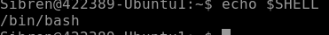
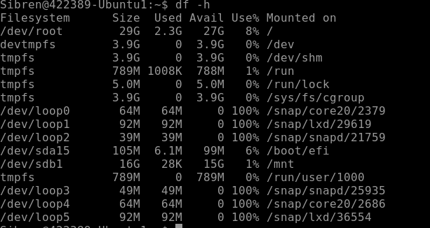
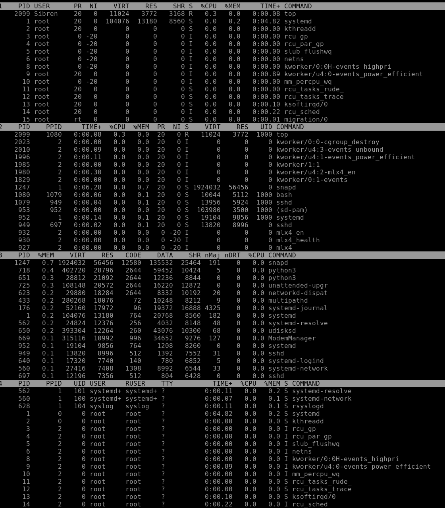
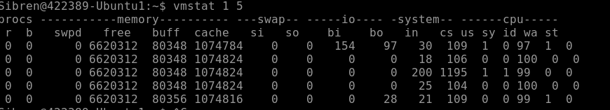
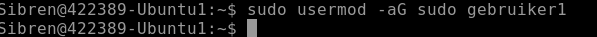
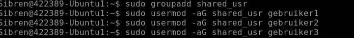
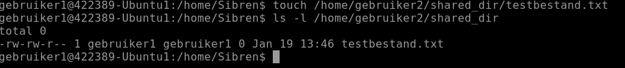
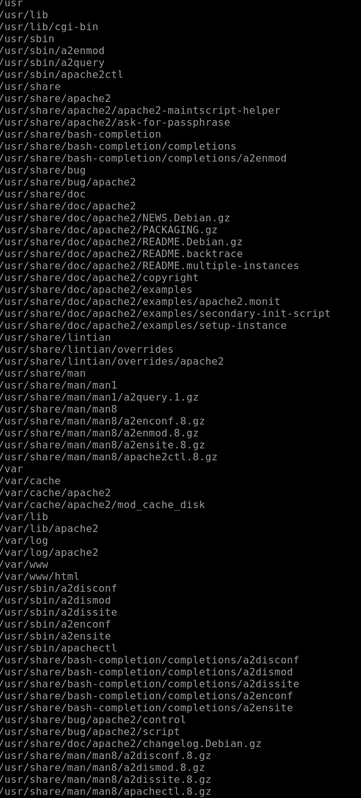
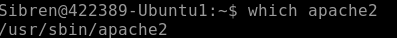

# Linux - Practicum week 1

In dit practicum gaan we werken aan de basisvaardigheden voor het gebruik van Linux (Unix) en leren we enkele essentiële systeembeheertaken uitvoeren. De opdracht richt zich op het vertrouwd raken met de kernprincipes en het zelfstandig kunnen uitvoeren van beheeractiviteiten binnen een Linux-omgeving. Dit omvat onder andere het werken met de terminal, navigeren door het bestandssysteem, en het uitvoeren van basiscommando’s om informatie op te vragen en systemen te beheren.

De onderdelen van dit practicum omvatten:

1. Basisvaardigheden in Linux (Unix): Hierbij leer je de kernvaardigheden om effectief met Linux (Unix) om te gaan. Dit omvat commando’s voor navigatie, bestandbeheer, en het aanpassen van gebruikersinstellingen.

2. Systeembeheer op Linux (Unix): Je voert enkele eenvoudige systeembeheeractiviteiten uit, zoals het beheren van processen, gebruikersrechten, en systeeminformatie. Dit onderdeel biedt je een fundament voor het beheren van een Linux-systeem.

**Belangrijk**: Bij elk commando dat je uitvoert om een resultaat of antwoord te verkrijgen, is het verplicht om een screenshot te maken van je scherm als bewijs van voortgang. Deze afbeeldingen tonen aan dat de opdracht correct is uitgevoerd en helpen je ook om je resultaten bij te houden.

Verder is het essentieel om al je voortgang en resultaten vast te leggen in een private Git-repository(Bijvoorbeeld op GitHub). Hiermee leer je niet alleen werken met versiebeheer, maar zorg je er ook voor dat alle stappen van je werk overzichtelijk en reproduceerbaar zijn.

Bij voorkeur gebruik je MarkDown, zodat het document ook nog enigszins oogt. Via deze link vind je meer informatie over Markdown op github:
[Basic writing and formatting syntax - GitHub Docs](https://docs.github.com/en/github/writing-on-github/getting-started-with-writing-and-formatting-on-github/basic-writing-and-formatting-syntax)

Een manier om gemakkelijk met markdown en git te werken is door in Visual Studio Code(VS Code) een plug-in voor Markdown the instaleren, en vanuit VS Code commits te maken en deze te pushen naar je eigen private Git Repo.

## Inleveren
Zowel de tekstdocumenten als de geproduceerde scripts houden jullie bij op zowel jullie Git repo. De tekstdocumenten en Scripts leveren jullie ook in op de Elo omgeving.

# Opdracht 1 - Basis commando's

## 1 a) Listing:
Met welk commando kun je alle `.java` files op het systeem tonen die voldoen aan de volgende voorwaarden:
1. ze zijn de afgelopen week aangepast
2. ze bevatten de string "Main"

## 1 b) Links:
Wat is het verschil tussen een symbolische link en een harde link?\
*Tip*: Wat gebeurt er in beide gevallen als je het doelbestand ('target') van de link verplaatst of verwijdert?

Een harde link is een extra directoryvermelding die direct verwijst naar hetzelfde inode (hetzelfde fysieke bestand op schijf). Een symbolische link (soft link) is een apart bestand dat een padnaam bevat die verwijst naar een ander bestand of directory.

## 1 c) Shell:
Hoe kun je zien welke Shell je gebruikt? Hoe heet het startup script?
 
 

## 1 d) Piping:
Wat is het commando om alle processen met in de PID “100” te tonen?\
(gebruik hierbij o.a. `grep`)

## 1 e) Path:
Hoe kun je je PATH-variabele aanpassen zodat je niet steeds `./filenaam` hoeft te typen, maar simpelweg `filenaam` kunt gebruiken om een bestand in de huidige directory uit te voeren?\
Wat moet je toevoegen aan je shell startup script om deze wijziging permanent te maken?

Om de huidige map aan je PATH toe te voegen zodat je bestanden direct kunt uitvoeren, gebruik je het commando export PATH="$PATH:.". Om dit permanent te maken, voeg je exact deze regel toe aan het bestand ~/.bashrc (voor Bash) of ~/.zshrc (voor Zsh) en herlaad je de instellingen daarna met source ~/.bashrc.
## 1 f) Manual page:
Hoe kun je in de manual-pagina (met het commando `man`) zoeken naar een specifieke string?\
*Tip*: Standaard gebruikt `man`  de '*less*' pager.\
Wat is het commando om verder te zoeken naar de volgende overeenkomst?\
Hoe kun je een pagina omhoog of omlaag scrollen?

In de manual-pagina zoek je naar een string door een schuine streep / te typen, gevolgd door de zoekterm en Enter. Om verder te zoeken naar de volgende overeenkomst druk je op de toets n (next), en om terug te zoeken naar de vorige overeenkomst op N. Om een pagina omlaag te scrollen gebruik je de Spatiebalk (of f) en om een pagina omhoog te scrollen gebruik je de toets b (back)
## 1 g) default directories:
Wat is het doel van de volgende directories? Geef een korte beschrijving van wat er typisch in deze directories wordt opgeslagen:

`/bin`\ Bevat essentiële uitvoerbare commando's voor alle gebruikers
`/lib`\ Bevat essentiële gedeelde bibliotheken (libraries) en kernelmodules die nodig zijn voor de programma's in /bin en /sbin.
`/media`\ Automatisch aankoppelpunt voor verwisselbare media zoals USB-sticks en CD-ROM's.
`/boot`\ Bevat alle bestanden die nodig zijn om het systeem op te starten, zoals de Linux kernel en de bootloader (GRUB).
`/proc`\ Een virtuele map die informatie over het systeem en draaiende processen bevat (bestaat alleen in het geheugen, niet op de schijf).
`/mnt`\ Een tijdelijk aankoppelpunt waar de administrator handmatig bestandssystemen of schijven kan koppelen.
`/dev`\ Bevat "device files" die verwijzen naar je hardware (bijv. je harde schijf /dev/sda of je toetsenbord).
`/root`\ De thuismap van de "supergebruiker" (root); deze staat apart van de gewone /home.
`/sbin`\ Bevat essentiële systeemcommando's die meestal door de administrator (root) worden gebruikt
`/etc`\ Dé plek voor alle systeembrede configuratiebestanden (bijv. wachtwoordinstellingen, netwerkconfiguratie).
`/usr`\ De grootste map, bevat door de gebruiker geïnstalleerde programma's, documentatie en bibliotheken
`/usr/share`\ Bevat architectuur-onafhankelijke data die gedeeld wordt door programma's, zoals iconen, fonts en handleidingen.
`/home`\ De persoonlijke mappen voor gewone gebruikers (bijv. documenten, downloads en persoonlijke instellingen).
`/usr/bin` en `/usr/sbin`\ De niet-essentiële varianten van de mappen in de root; hier staan de meeste standaard applicaties en beheertools.
`/var`\ Voor "variabele" data die tijdens het gebruik groeit, zoals logbestanden (/var/log), mail en databases.

## 1 h) default directories:

Waar vind je de volgende bestanden en wat is hun functie in het systeem?

1. `mount`, `ping`, `rm`, `mkfs`, `fdisk`, `rsyslogd`, `grub` en/of `lilo`
   
   De commando's mount, ping en rm bevinden zich in de directory /bin omdat dit essentiële hulpmiddelen zijn voor alle gebruikers. De beheercommando's mkfs, fdisk en de service rsyslogd staan in /sbin, aangezien deze bedoeld zijn voor systeembeheer door de root-gebruiker. De bootloaders grub en lilo bevinden zich in de directory /boot, waar alle bestanden worden opgeslagen die nodig zijn om het Linux-systeem daadwerkelijk op te starten.
2. De `man`-pagina's (binaries en gecomprimeerde bestanden, zoals `*.gz`)

    De man-binaries staan doorgaans in /usr/bin, terwijl de feitelijke handleidingen (de gecomprimeerde .gz bestanden) zijn opgeslagen in de directory /usr/share/man. De functie van deze bestanden is het bieden van een offline documentatiesysteem voor vrijwel alle commando's en configuratiebestanden op het systeem.
3. Configuratiebestanden voor netwerkinterfaces (interfaces) en hosts (hosts)
    
    De configuratiebestanden voor netwerkinterfaces (interfaces) en hosts (hosts) bevinden zich in de directory /etc. Deze bestanden hebben als functie het definiëren van de netwerkidentiteit van de computer, waarbij hosts lokale naamomzetting regelt en interfaces de instellingen voor de fysieke of virtuele netwerkkaarten bevat.

# Opdracht 2 - Systeembeheer

## 2 a) Alias instellen voor home-directory
Welk commando kun je gebruiken om ervoor te zorgen dat wanneer je `home` in de console invoert, de huidige directory automatisch navigeert naar je home-directory? Leg uit hoe dit werkt.

Gebruik het commando alias home='cd ~'. Dit maakt een snelkoppeling waarbij de naam home de opdracht cd (change directory) naar de ~ (thuismap) uitvoert. Om dit permanent te maken, voeg je deze regel toe aan je ~/.bashrc bestand.
## 2 b) Overzicht van gemounte bestandssystemen
Welk commando geeft een overzicht van alle gemounte bestandssystemen en de beschikbare opslagruimte?

## 2 c) Het doel van `/proc`
Waarvoor worden de bestanden in de `/proc` directory gebruikt? Beschrijf hun algemene functie binnen het systeem.

De directory /proc is een virtueel bestandssysteem dat live informatie bevat over de kernel en draaiende processen. Het dient als interface om systeemgegevens en hardwarestatus (zoals CPU- en geheugengebruik) direct vanuit het werkgeheugen uit te lezen
## 2 d) Specifieke bestanden in `/proc`
In de directory `/proc` staan onder andere de volgende virtuele bestanden: `version`, `cpuinfo`, `meminfo`, en `ioports`. Welke informatie geven deze bestanden? Beschrijf kort de inhoud van elk bestand.

version: Toont de huidige Linux-kernelversie en de compiler (GCC) waarmee deze is gebouwd.
cpuinfo: Bevat details over de processor, zoals het model, de kloksnelheid en het aantal cores.
meminfo: Geeft een gedetailleerd overzicht van het geheugengebruik, inclusief het totale, vrije en beschikbare RAM.
ioports: Toont een lijst van geregistreerde input/output-regio's die worden gebruikt voor communicatie met hardware-apparate

## 2 e) Device files voor harde schijven
Wat zijn de namen van de device files waarmee de kernel de harde schijven kan benaderen? Geef een overzicht van de naamgevingsconventies voor verschillende typen opslagapparaten (IDE, SATA, SCSI, NVMe).

SATA/SCSI/USB/IDE (modern): /dev/sdX (bijv. /dev/sda voor de eerste schijf, /dev/sdb voor de tweede).

NVMe: /dev/nvmeXnY (bijv. /dev/nvme0n1 voor de eerste controller, eerste schijf).

Partities: Worden aangeduid met een nummer achter de schijfnaam (bijv. /dev/sda1 of /dev/nvme0n1p1).

IDE: /dev/hdX (bijv. /dev/hda).

## 2 f) Systeemmeldingen bekijken
Met welk commando kun je de laatste belangrijke systeemmeldingen (logs) bekijken? Beschrijf hoe je dit gebruikt om snel toegang te krijgen tot recente meldingen.

journalctl -xe
Dit toont de laatste systeemmeldingen met foutdetails en is het standaard commando op systemd-systemen.

## 2 g) Processen overzicht
Met welk commando kun je een overzicht krijgen van alle lopende processen op het systeem? Leg uit hoe je hiermee processen kunt beheren of controleren.

top of htop. Hiermee zie je live het CPU- en geheugengebruik per proces. Je kunt processen beheren door op k (kill) te drukken en het Proces-ID (PID) in te voeren om een vastgelopen programma te beëindigen.
## 2 h) Services starten en instellen bij opstarten
Hoe kun je een service starten op het systeem, en hoe stel je een service zo in dat deze automatisch start bij het opstarten van het systeem? Beschrijf de benodigde commando's en de instellingen die hiervoor nodig zijn.

Gebruik sudo systemctl start <service> om een service direct te activeren en sudo systemctl enable <service> om deze automatisch te laten starten bij het opstarten van het systeem. Deze commando's beheren de zogeheten unit-bestanden via de systemd-manager.
# Opdracht 3 - Performance Monitoring

## 3 a) Overzicht van processen in `top`
Het commando `top` geeft een overzicht van processen en hun resourcegebruik, waarbij standaard wordt gesorteerd op CPU-gebruik. Het sample-interval is standaard ingesteld op 5 seconden.

Met welke toets kun je een "toggle" uitvoeren tussen een enkel overzicht en de "alternate display"? Dit toont een gesorteerd overzicht van de belangrijkste "consumers" van verschillende systeemresources.

Je voert deze toggle uit met de toets A (hoofdletter). Dit activeert de "alternate display" modus, waarbij het scherm wordt opgedeeld in vier groepen om verschillende resource-gebruikers gelijktijdig te monitoren.

## 3 b) Analyse met `vmstat`
Het `vmstat`-commando geeft informatie over processen, geheugen, paging, block I/O, traps, en CPU-activiteit. Voer het `vmstat`-commando uit en bekijk de kolommen onder het gedeelte "procs".

1. Wat betekenen de velden "r" en "b" onder het gedeelte "procs"?
   
   r (runnable): Het aantal processen dat wacht op CPU-tijd. b (blocked): Het aantal processen in een ononderbroken slaapstand (wachtend op I/O
2. Hoeveel interrupts en context switches per seconde worden er ongeveer gemeten?
   
   Er worden gemiddeld ongeveer 59 interrupts (in) en 325 context switches (cs) per seconde gemeten
    
## 3 c) Processor-informatie met `mpstat`
Run het commando `mpstat -A`.

Hoeveel processoren (CPU's) zijn er in je systeem?
Er runenn 2 CPU's 0 en 1

# Opdracht 4 - Users en permissies

## 4 a) Uitleg van `rwx` permissies voor directories
Leg uit wat de `rwx`-permissies betekenen wanneer ze worden toegepast op een directory. Beschrijf hoe deze rechten zich verhouden tot de toegangsmogelijkheden voor gebruikers.

r (read): Je mag de namen van de bestanden in de directory bekijken (bijv. via ls).
w (write): Je mag bestanden in de directory aanmaken, verwijderen of hernoemen.
x (execute): Je mag de directory "betreden" (bijv. via cd) en de metadata van bestanden opvragen.

## 4 b) Rechten instellen op `rwxrwxrwx`
Met welk commando kun je de rechten van een bestand instellen op `rwxrwxrwx`? Beschrijf de stappen en betekenis van de opdracht.

Gebruik het commando chmod 777 <bestandsnaam>. Hiermee geef je de eigenaar, de groep en alle andere gebruikers volledige lees-, schrijf- en uitvoerrechten. De waarde 777 is gebaseerd op een binaire optelsom waarbij 4 staat voor lezen (read), 2 voor schrijven (write) en 1 voor uitvoeren (execute); de som 4+2+1=7 wordt per categorie toegepast.
## 4 c) Groep van een gebruiker aanpassen
Hoe kun je de primaire groep van een gebruiker wijzigen? Geef een voorbeeld van het commando en leg de syntaxis kort uit.

Gebruik het commando sudo usermod -g <groepsnaam> <gebruikersnaam>. De optie -g staat voor de primaire groep (gid), gevolgd door de naam van de nieuwe groep en de naam van de gebruiker die je wilt wijzige

## 4 d) Gebruikers met eigen SSH-sleutels aanmaken
Creëer drie gebruikers die elk met hun eigen SSH-sleutel kunnen inloggen. Beschrijf de stappen om de gebruikers aan te maken en de SSH-sleutels in te stellen.

Maak de gebruiker aan met sudo adduser <naam>, wissel naar die gebruiker met su - <naam> en maak de benodigde map aan via mkdir -p ~/.ssh && chmod 700 ~/.ssh. Maak vervolgens met nano ~/.ssh/authorized_keys het bestand aan, plak hierin de publieke sleutel die je met PuTTYgen hebt gegenereerd, sla op met Ctrl+O en Enter, en sluit af met Ctrl+X. Beveilig tot slot het bestand met chmod 600 ~/.ssh/authorized_keys zodat de SSH-service de sleutel accepteert voor het inloggen.
## 4 e) Gebruiker toevoegen aan de `sudoers`-groep
Maak één van de eerder aangemaakte gebruikers lid van de `sudoers`-groep, zodat deze gebruiker beheerrechten krijgt. Geef het benodigde commando en leg uit hoe je kunt verifiëren dat de gebruiker lid is van `sudoers`.

## 4 f) Gedeelde directory en groep aanmaken
1. Maak in de home-directory van alle drie de gebruikers een directory met de naam `shared_dir`.
   
2. Creëer een groep genaamd `shared_usr` en maak de drie gebruikers lid van deze groep.
   
3. Geef de groep lees- en schrijfrechten op de `shared_dir` in elke home-directory.
   
4. Controleer of de gebruikers elkaar toegang kunnen geven tot hun `shared_dir`-directory.

# Opdracht 5 - Installeren van applicaties

## 5 a) Extracten van `.tgz` en `.tar.gz` bestanden
Veel Linux-software wordt geleverd in een zogenaamde “tarball” met extensies zoals `.tgz` of `.tar.gz`. Welke commando's gebruik je om zo'n bestand uit te pakken? Geef een voorbeeld met uitleg.

Je pakt een .tar.gz of .tgz bestand uit met het commando tar -xzvf bestandsnaam.tar.gz. In dit commando staat de -x voor het extraheren van de inhoud, de -z geeft aan dat het bestand met gzip is gecomprimeerd, de -v zorgt ervoor dat je tijdens het proces ziet welke bestanden worden uitgepakt en de -f vertelt het programma dat het volgende argument de bestandsnaam is. Een concreet voorbeeld is tar -xzvf backup.tgz, waarbij de inhoud van de tarball direct in de huidige werkmap wordt geplaatst.
## 5 b) Overzicht van geïnstalleerde pakketten met `dpkg`
Met welk `dpkg`-commando kun je een lijst van alle geïnstalleerde pakketten opvragen? Beschrijf wat de output bevat en waarvoor dit handig is.

Gebruik het commando dpkg -l om een lijst van alle geïnstalleerde pakketten op te vragen.
De output bevat kolommen met de status van het pakket, de pakketnaam, de geïnstalleerde versie, de architectuur (bijvoorbeeld amd64) en een korte beschrijving van de software. Dit is handig voor systeembeheerders om te controleren of specifieke software aanwezig is, versies te vergelijken bij updates, of om de exacte naam van een pakket te vinden voordat je het verwijdert.
## 5 c) Bestanden in een pakket opvragen met `dpkg`
Met welk `dpkg`-commando kun je achterhalen welke bestanden er bij het pakket `apache2` horen? Geef een voorbeeld en beschrijf kort hoe de output te interpreteren is.

Je achterhaalt de bestanden van het pakket apache2 met het commando dpkg -L apache2. De output toont een lijst met absolute paden naar alle geïnstalleerde onderdelen, waarbij locaties zoals /usr/sbin/ de uitvoerbare bestanden bevatten, /etc/ de configuratiebestanden, /var/www/ de webcontent en /usr/share/man/ de handleidingen. Door deze lijst te scannen, kun je precies zien waar de software zich in de mappenstructuur van het systeem bevindt.

## 5 d) Locatie van `apache2` executable
Waar bevindt zich het uitvoerbare bestand (`executable`) voor `apache2`? Leg uit hoe je dit kunt achterhalen.

Het uitvoerbare bestand van Apache2 bevindt zich in /usr/sbin/apache2. Je achterhaalt dit door het commando which apache2 of whereis apache2 te typen in de terminal. which toont het exacte pad van het programma dat wordt uitgevoerd, terwijl whereis ook de locaties van de broncode en handleidingen vermeldt.

## 5 e) Locatie van de `DocumentRoot` variabele
In welk configuratiebestand wordt de `DocumentRoot`-variabele voor `apache2` gedefinieerd? Beschrijf kort hoe je dit bestand kunt vinden en openen.

Je vindt dit bestand door het commando grep -r "DocumentRoot" /etc/apache2/ uit te voeren. Dit commando doorzoekt alle bestanden in de Apache-configuratiemap naar de tekst "DocumentRoot" en toont je direct in welk bestand de variabele is gedefinieerd.

