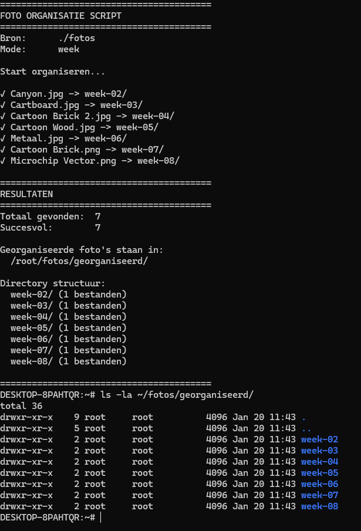
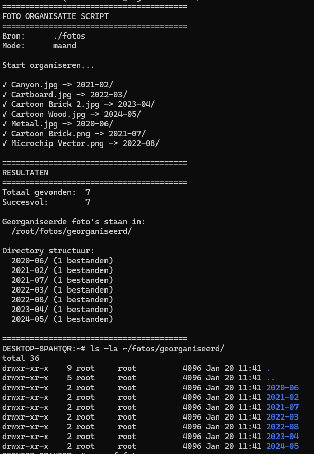

# Linux - Practicum week 2

In dit practicum gaan we werken aan de basisvaardigheden voor het gebruik van Linux (Unix) en leren we enkele essentiële systeembeheertaken uitvoeren. De opdracht richt zich op het vertrouwd raken met de kernprincipes en het zelfstandig kunnen uitvoeren van beheeractiviteiten binnen een Linux-omgeving. Dit omvat onder andere het werken met de terminal, navigeren door het bestandssysteem, en het uitvoeren van basiscommando’s om informatie op te vragen en systemen te beheren.

De onderdelen van dit practicum omvatten:

1. Bash scripting: Hierbij leer je de basisvaardigheden van bash scripting om efficiënt taken te automatiseren binnen een Linux-omgeving. Dit omvat het schrijven van scripts voor bestandsbeheer, systeembeheer en het uitvoeren van herhalende taken met variabelen, loops en voorwaarden.

**Belangrijk**: Bij elk commando dat je uitvoert om een resultaat of antwoord te verkrijgen, is het verplicht om een screenshot te maken van je scherm als bewijs van voortgang. Deze afbeeldingen tonen aan dat de opdracht correct is uitgevoerd en helpen je ook om je resultaten bij te houden.

Verder is het essentieel om al je voortgang en resultaten vast te leggen in een private Git-repository(Bijvoorbeeld op GitHub). Hiermee leer je niet alleen werken met versiebeheer, maar zorg je er ook voor dat alle stappen van je werk overzichtelijk en reproduceerbaar zijn.

Bij voorkeur gebruik je MarkDown, zodat het document ook nog enigszins oogt. Via deze link vind je meer informatie over Markdown op github:
[Basic writing and formatting syntax - GitHub Docs](https://docs.github.com/en/github/writing-on-github/getting-started-with-writing-and-formatting-on-github/basic-writing-and-formatting-syntax)

Een manier om gemakkelijk met markdown en git te werken is door in Visual Studio Code(VS Code) een plug-in voor Markdown the instaleren, en vanuit VS Code commits te maken en deze te pushen naar je eigen private Git Repo.


## Inleveren
Zowel de tekstdocumenten als de geproduceerde scripts houden jullie bij op zowel jullie Git repo. De tekstdocumenten en Scripts leveren jullie ook in op de Elo omgeving.

# Opdracht: Automatisch Foto's Organiseren met een Linux Shell Script

## Probleemomschrijving
Stel dat je een smartphone hebt waarmee je dagelijks mooie foto’s maakt. Deze foto’s worden automatisch gedeeld en gesynchroniseerd met je laptop via een cloud-oplossing. Na een jaar merk je dat het organiseren van foto’s in verschillende mappen veel tijd kost, vooral omdat je de foto’s wilt kunnen terugvinden door ze in logische submappen te plaatsen.

Je besluit om een eenvoudig tooltje te maken in de vorm van een Linux shell script dat de foto’s automatisch in mappen organiseert. Het script helpt je om tijd te besparen door foto’s te verplaatsen naar mappen op basis van het moment waarop ze zijn gemaakt.

## Doelstelling
Maak een shell script dat foto’s automatisch organiseert door ze te verplaatsen naar submappen, gesorteerd op basis van de maand of week waarin ze zijn gemaakt. Dit script moet voldoen aan de volgende specificaties:

- Het script accepteert twee parameters:
  - **Eerste parameter**: De directory waarin de foto's staan.
  - **Tweede parameter**: Een aanduiding, “maand” of “week”.
  
  Afhankelijk van de tweede parameter organiseert het script de foto’s in mappen op basis van maand of week.

- Het script moet:
  - Foto’s verplaatsen naar een nieuw te maken map.
  - Bij de optie “week” de foto’s verplaatsen naar submappen met het corresponderende weeknummer.
  - De originele foto alleen verwijderen als de verplaatsing succesvol is.

## Functie-eisen

1. **Parameterbeheer**:
   - Het script moet controleren of beide parameters aanwezig zijn.
   - De eerste parameter geeft de bronmap van de foto’s aan.
   - De tweede parameter moet “maand” of “week” zijn. Het script moet controleren of dit correct is ingevoerd.

2. **Automatisch Organiseren**:
   - Als de tweede parameter “maand” is, moet het script foto’s verplaatsen naar submappen op basis van de maand waarin de foto is gemaakt.
   - Als de tweede parameter “week” is, moet het script foto’s verplaatsen naar submappen met het corresponderende weeknummer van het jaar.

3. **Hashcontrole en Verwijdering**:
   - Na het verplaatsen moet het script de hash (bijvoorbeeld met behulp van `md5sum`) van de originele foto en de kopie in de doellocatie controleren.
   - Alleen als de hashes overeenkomen (dus de verplaatsing is succesvol) wordt de originele foto verwijderd.

4. **Foutafhandeling**:
   - Het script moet meldingen geven voor ontbrekende parameters of foutieve invoer.
   - Bij een fout in het kopiëren mag de originele foto niet worden verwijderd en moet er een foutmelding worden weergegeven.

## Voorbeeldgebruik

Stel dat je een script hebt genaamd `foto_organiseer.sh`. Hieronder volgen enkele voorbeeldcommando’s:

```bash
# Verplaats foto’s naar maandelijkse mappen
./foto_organiseer.sh /pad/naar/fotos maand

# Verplaats foto’s naar wekelijkse mappen
./foto_organiseer.sh /pad/naar/fotos week
```

In dit voorbeeld:

- **Maand**: Foto’s worden verplaatst naar mappen zoals `/pad/naar/fotos/2024-01` voor januari 2024, `/pad/naar/fotos/2024-02` voor februari, etc.
- **Week**: Foto’s worden verplaatst naar mappen zoals `/pad/naar/fotos/week-01` voor de eerste week van het jaar, `/pad/naar/fotos/week-02` voor de tweede week, etc.

## Implementatie-instructies

1. **Parametercontrole**:
   - Controleer of er precies twee parameters zijn ingevoerd.
   - Controleer of de tweede parameter geldig is (“maand” of “week”).

2. **Maak de Mappen aan en Verplaats Foto's**:
   - Gebruik bestandsinformatie (zoals wijzigingsdatum) om foto’s in de juiste map te plaatsen.
   - Voor “maand” maakt het script mappen aan op basis van jaar en maand.
   - Voor “week” maakt het script mappen aan op basis van het weeknummer van het jaar.

3. **Hashverificatie voor Verwijdering**:
   - Na het kopiëren van een foto, vergelijk je de hash (met `md5sum`) van de bron en de doelkopie.
   - Verwijder de originele foto alleen als de hashwaarden overeenkomen, zodat je zeker weet dat de kopie identiek is.

4. **Logging en Foutmeldingen**:
   - Voeg meldingen toe zodat de gebruiker kan zien wat het script doet.
   - Geef foutmeldingen als er iets misgaat, bijvoorbeeld als een bestand niet succesvol kan worden gekopieerd.

Met deze instructies kun je een eenvoudig maar nuttig script maken dat je foto’s automatisch organiseert en beheert.

**Script**
cat > foto_organiseer.sh << 'EOF'
#!/bin/sh
# foto_organiseer.sh - Weekopdracht 2: Automatisch Foto's Organiseren
# Exact volgens opdrachtspecificaties

# ---------- FUNCTIES ----------
toon_help() {
    echo "Gebruik: $0 <bron_directory> <maand|week>"
    echo ""
    echo "Voorbeelden:"
    echo "  $0 ./fotos maand"
    echo "  $0 /pad/naar/fotos week"
}

# ---------- PARAMETER CONTROLE ----------
if [ $# -ne 2 ]; then
    echo "FOUT: Verkeerd aantal parameters!"
    toon_help
    exit 1
fi

BRON_DIR="$1"
MODE="$2"

# Controleer bron directory
if [ ! -d "$BRON_DIR" ]; then
    echo "FOUT: Directory '$BRON_DIR' bestaat niet"
    exit 1
fi

# Controleer mode
if [ "$MODE" != "maand" ] && [ "$MODE" != "week" ]; then
    echo "FOUT: Mode moet 'maand' of 'week' zijn"
    exit 1
fi

echo "========================================"
echo "FOTO ORGANISATIE SCRIPT"
echo "========================================"
echo "Bron directory: $BRON_DIR"
echo "Organisatie op: $MODE"
echo ""

# ---------- VOORBEREIDING ----------
cd "$BRON_DIR" || { echo "FOUT: Kan niet naar $BRON_DIR gaan"; exit 1; }

# Maak doel directory aan
DOEL_DIR="georganiseerd"
mkdir -p "$DOEL_DIR"

# ---------- HOOFD VERWERKING ----------
TOTAAL=0
SUCCES=0

for FOTO in *.jpg *.jpeg *.png *.JPG *.JPEG *.PNG; do
    [ -f "$FOTO" ] || continue
    
    TOTAAL=$((TOTAAL + 1))
    FOTO_NAAM=$(basename "$FOTO")
    
    # ---------- DATUM BEPALEN ----------
    # Bepaal mapnaam op basis van maand of week
    DATUM=""
    if command -v stat >/dev/null 2>&1; then
        DATUM=$(stat -c %y "$FOTO" 2>/dev/null)
    fi
    
    if [ "$MODE" = "maand" ]; then
        if [ -n "$DATUM" ]; then
            JAAR=$(echo "$DATUM" | cut -d'-' -f1)
            MAAND=$(echo "$DATUM" | cut -d'-' -f2)
            MAP_NAAM="${JAAR}-${MAAND}"
        else
            # Fallback voor test
            MAP_NAAM="2024-$(printf "%02d" $(( (TOTAAL % 12) + 1 )))"
        fi
    else
        # WEEK mode
        if [ -n "$DATUM" ] && command -v date >/dev/null 2>&1; then
            WEEK=$(date -d "$DATUM" +%U 2>/dev/null || echo "01")
            MAP_NAAM="week-$(printf "%02d" $WEEK)"
        else
            MAP_NAAM="week-$(printf "%02d" $(( (TOTAAL % 52) + 1 )))"
        fi
    fi
    
    # ---------- HASH CONTROLE (VOOR verplaatsen) ----------
    # Bereken hash van origineel VOORDAT we iets doen
    if command -v md5sum >/dev/null 2>&1; then
        HASH_ORIG=$(md5sum "$FOTO" | awk '{print $1}')
    else
        echo "FOUT: md5sum niet beschikbaar voor hash controle"
        exit 1
    fi
    
    # Maak doel submap
    mkdir -p "${DOEL_DIR}/${MAP_NAAM}"
    
    # ---------- VERPLAATSEN ----------
    DOEL_BESTAND="${DOEL_DIR}/${MAP_NAAM}/${FOTO_NAAM}"
    
    # Eerst kopiëren voor veiligheid
    cp "$FOTO" "$DOEL_BESTAND"
    
    if [ $? -eq 0 ]; then
        # Controleer hash van de kopie
        HASH_KOPIE=$(md5sum "$DOEL_BESTAND" | awk '{print $1}')
        
        if [ "$HASH_ORIG" = "$HASH_KOPIE" ]; then
            # Hash komt overeen - VERWIJDER origineel (verplaatsing compleet)
            rm "$FOTO"
            echo "✓ Verplaatst: $FOTO_NAAM -> $MAP_NAAM/"
            SUCCES=$((SUCCES + 1))
        else
            # Hash mismatch - verwijder de slechte kopie
            rm "$DOEL_BESTAND"
            echo "✗ $FOTO_NAAM: Hash mismatch! Foto niet verplaatst."
        fi
    else
        echo "✗ $FOTO_NAAM: Kon foto niet kopiëren voor verplaatsing."
    fi
done

# ---------- RESULTATEN ----------
echo ""
echo "========================================"
echo "RESULTATEN"
echo "========================================"
echo "Totaal foto's:     $TOTAAL"
echo "Succesvol verplaatst: $SUCCES"

if [ $TOTAAL -gt 0 ] && [ $SUCCES -lt $TOTAAL ]; then
    MISLUKT=$((TOTAAL - SUCCES))
    echo "Mislukt:          $MISLUKT"
fi

echo ""
echo "Georganiseerde foto's staan in:"
echo "  $(pwd)/${DOEL_DIR}/"
echo ""
if [ -d "$DOEL_DIR" ] && [ "$(ls -A "$DOEL_DIR" 2>/dev/null)" ]; then
    echo "Aangemaakte mappen:"
    for MAP in "${DOEL_DIR}"/*/; do
        [ -d "$MAP" ] || continue
        MAP_NAAM=$(basename "$MAP")
        AANTAL=$(ls -1 "$MAP" 2>/dev/null | wc -l)
        echo "  ${MAP_NAAM}/ (${AANTAL} foto's)"
    done
else
    echo "Geen foto's succesvol verplaatst."
fi

echo ""
echo "========================================"
EOF


**Test Screenshots**

