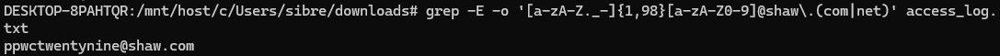
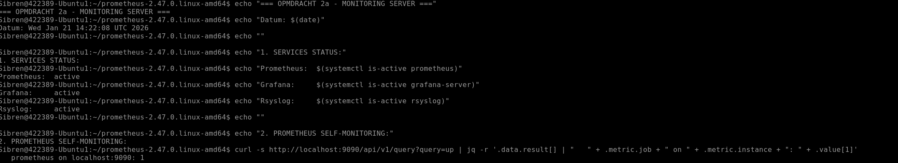
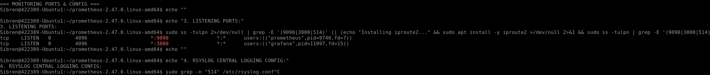
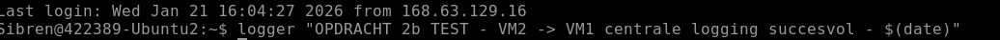
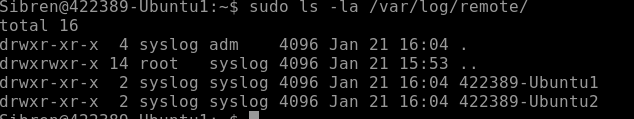
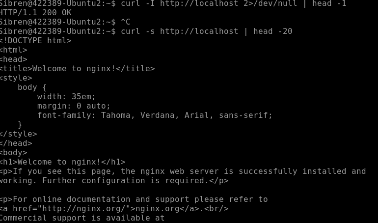
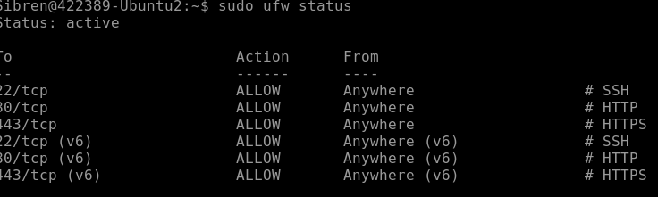
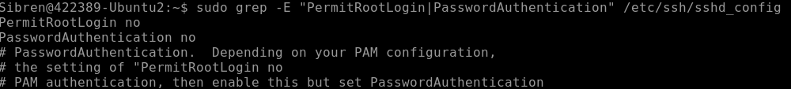
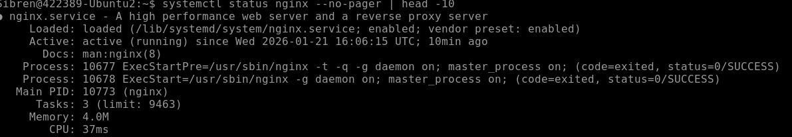

# Linux - Practicum Week 3


In dit practicum gaan we werken aan de basisvaardigheden voor het gebruik van Linux (Unix) en leren we enkele essentiële systeembeheertaken uitvoeren. De opdracht richt zich op het vertrouwd raken met de kernprincipes en het zelfstandig kunnen uitvoeren van beheeractiviteiten binnen een Linux-omgeving. Dit omvat onder andere het werken met de terminal, navigeren door het bestandssysteem, en het uitvoeren van basiscommando’s om informatie op te vragen en systemen te beheren.

De onderdelen van dit practicum omvatten:

1. RegEx: Hierbij leer je de basisvaardigheden om effectief met regex (reguliere expressies) te werken. Dit omvat technieken voor patroonherkenning, het extraheren van gegevens, en het verfijnen van zoekopdrachten binnen teksten.

2. Monitoring en Logging: Hierbij leer je de kernvaardigheden voor monitoring en logging. Dit omvat het opzetten van tools voor het bijhouden van systeemstatus, het verzamelen van loggegevens en het inzichtelijk maken van prestaties binnen een Linux-omgeving.

**Belangrijk**: Bij elk commando dat je uitvoert om een resultaat of antwoord te verkrijgen, is het verplicht om een screenshot te maken van je scherm als bewijs van voortgang. Deze afbeeldingen tonen aan dat de opdracht correct is uitgevoerd en helpen je ook om je resultaten bij te houden.

Verder is het essentieel om al je voortgang en resultaten vast te leggen in een private Git-repository(Bijvoorbeeld op GitHub). Hiermee leer je niet alleen werken met versiebeheer, maar zorg je er ook voor dat alle stappen van je werk overzichtelijk en reproduceerbaar zijn.

Bij voorkeur gebruik je MarkDown, zodat het document ook nog enigszins oogt. Via deze link vind je meer informatie over Markdown op github:
[Basic writing and formatting syntax - GitHub Docs](https://docs.github.com/en/github/writing-on-github/getting-started-with-writing-and-formatting-on-github/basic-writing-and-formatting-syntax)

Een manier om gemakkelijk met markdown en git te werken is door in Visual Studio Code(VS Code) een plug-in voor Markdown the instaleren, en vanuit VS Code commits te maken en deze te pushen naar je eigen private Git Repo.

## Inleveren
Zowel de tekstdocumenten als de geproduceerde scripts houden jullie bij op zowel jullie Git repo. De tekstdocumenten en Scripts leveren jullie ook in op de Elo omgeving.

# Opdracht 1: RegEx

In de file `apache-access-log.txt` vind je een access-log.
Schrijf een RegEx die e-mailadressen herkent van het bedrijf “Shaw”. Dit bedrijf is zowel
onder de TLD `.com` als `.net` geregistreerd.

De basisconventies van het Shaw-bedrijf volgen de e-mailnaamgeving van RFC [5322](https://datatracker.ietf.org/doc/html/rfc5322#section-3.4.1).
Daarnaast hanteren ze de volgende naamgevingssystematiek:
- Generieke opbouw van een e-mailadres bij Shaw is: `<mailnaam>@shaw.com` of `<mailnaam>@shaw.net`
- Voor de `<mailnaam>` geldt:
  - Minimaal 2 karakters (karakter = cijfer, letter, of speciale tekens), maximaal 99 karakters
  - De laatste positie bevat ofwel een letter (“a” t/m “z”, “A” t/m “Z”) of een cijfer (“0” t/m “9”)
  - Op andere posities zijn geen cijfers toegestaan; alleen letters of de speciale tekens `.`, `_`, en `-`
  - Andere speciale tekens zijn geheel niet toegestaan

Je kunt de regex als volgt controleren:

```bash
grep -E -o "<YOUR_REGEX>" apache-access-log.txt
```

[a-zA-Z._-]{1,98}[a-zA-Z0-9]@shaw.(com|net)

# Opdracht 2: Monitoring en Logging

## 2 a) Setup van een Monitoring/Logging Server

Zet een Linux server op die dient als een Monitoring/Logging server.

Als logging/monitoring tools kun je de volgende opties gebruiken:
- Syslog
- Netdata
- Prometheus + graphana
- (Andere tools zijn toegestaan in overleg met de docent)


> Zorg dat je per optie uit kunt leggen hoe deze zou werken en wat de voor en nadelen zouden zijn aan het gebruik van de optie. Leg ook het verschil tussen logging en monitoring uit.


## 2 b) Setup van een Server voor Monitoring

Zet een tweede Linux server op (of herbruik de server die je al had voor weken 1 en 2) die door de monitorserver uit opdracht 2 a) gemonitord zal worden.
> Deze server moet dus logging data kunnen verzenden naar de monitoring server van 2 a).


## 2 c) Installatie van een Webserver

Installeer op de server van 2 b) een webserver (zoals Apache of NGINX) om bijvoorbeeld een WordPress applicatie op te hosten. De logs van deze applicaties dienen te worden verzameld door de logserver. Deze verzamelde logs moeten inzichtelijk worden gemaakt in de monitoring stack.
> Als anternatief zouden jullie een Flask webapp (zoals jullie in jaar 1 gebouwd hebben) of een bestaande opensource webapp van de [GitHub awesome-selfhosted lijst](https://github.com/awesome-selfhosted/awesome-selfhosted) kunnen hosten


## 2 d) Hardening van de Webserver

Zorg voor een hardening-script dat de Webserver van 2 b/c) beter beveiligt dan de standaardinstellingen. Zoek op wat system hardening betekend en pas een hardening techniek toe. Leg uit hoe je dit gedaan heb en laat hier zoals altijd screenshots van zien.

System hardening betekent het beveiligen van een server door onnodige toegang en functionaliteit te verwijderen om het aanvalsoppervlak te verkleinen. Voor mijn webserver VM2 heb ik dit gedaan door een hardening script te maken dat drie belangrijke beveiligingsverbeteringen toepast ten opzichte van de standaardinstellingen.

Eerst heb ik de firewall geconfigureerd met UFW. Waar normaal alle poorten open staan, staan nu alleen poort 22 voor SSH, poort 80 voor HTTP en poort 443 voor HTTPS open. Dit beperkt de mogelijke toegangspunten tot het absolute minimum.

Vervolgens heb ik SSH beveiligd door root login en password authentication uit te schakelen. Standaard kan de root gebruiker inloggen met wachtwoord, maar nu is dat niet meer mogelijk. Alleen authenticatie via SSH keys wordt nog toegestaan, wat veel veiliger is.

Tenslotte heb ik automatische security updates ingeschakeld. In plaats van handmatig updates uit te voeren, krijgt de server nu dagelijks automatisch security patches geïnstalleerd via het unattended-upgrades pakket.


## Script voor 2d

#!/bin/bash

echo "=== Webserver hardening - Start ==="

echo ""

#Firewall configuratie

echo "Stap 1: Firewall instellen..."

sudo ufw --force reset > /dev/null 2>&1

echo "y" | sudo ufw --force enable > /dev/null 2>&1

sudo ufw allow 22/tcp

sudo ufw allow 80/tcp

sudo ufw allow 443/tcp

echo "Firewall regels ingesteld:"

sudo ufw status

echo ""

#SSH beveiliging

echo "Stap 2: SSH configuratie aanpassen..."

sudo cp /etc/ssh/sshd_config /etc/ssh/sshd_config.backup

sudo sed -i 's/#PermitRootLogin yes/PermitRootLogin no/' /etc/ssh/sshd_config

sudo sed -i 's/#PasswordAuthentication yes/PasswordAuthentication no/' /etc/ssh/sshd_config

sudo systemctl restart sshd

echo "SSH configuratie aangepast."

echo " - Root login: uitgeschakeld"

echo " - Password authentication: uitgeschakeld"

echo ""

#Automatische updates

echo "Stap 3: Automatische updates inschakelen..."

sudo apt install -y unattended-upgrades

sudo tee /etc/apt/apt.conf.d/20auto-upgrades > /dev/null << EOF

APT::Periodic::Update-Package-Lists "1";

APT::Periodic::Unattended-Upgrade "1";

APT::Periodic::AutocleanInterval "7";

EOF

echo "Automatische security updates zijn nu actief."

echo ""

#Onnodige packages verwijderen

echo "Stap 4: Onnodige software verwijderen..."

sudo apt remove -y telnet 2>/dev/null || true

sudo apt remove -y rsh-client 2>/dev/null || true

sudo apt remove -y rsh-server 2>/dev/null || true

echo "Onnodige packages zijn verwijderd."

echo ""

#Controle of services nog werken

echo "Stap 5: Controle van essentiële services..."

echo "Nginx status: $(systemctl is-active nginx)"

echo "Node Exporter status: $(systemctl is-active node_exporter)"

echo "Rsyslog status: $(systemctl is-active rsyslog)"

echo ""

#Test of website nog bereikbaar is

echo "Stap 6: Website functionaliteit testen..."

HTTP_CODE=$(curl -s -o /dev/null -w "%{http_code}" http://localhost)

if [ "$HTTP_CODE" = "200" ]; then

   echo "Website reageert normaal (HTTP $HTTP_CODE)"
else
  echo "Waarschuwing: Website geeft code $HTTP_CODE"

fi

echo ""

echo "=== Hardening voltooid ==="

echo "Overzicht van uitgevoerde beveiligingsmaatregelen:"

echo "1. Firewall: alleen SSH, HTTP en HTTPS toegestaan"

echo "2. SSH: beveiligd tegen root login en password auth"

echo "3. Automatische updates: ingeschakeld voor security patches"

echo "4. Onnodige software: verwijderd"

echo "5. Alle monitoring en web services: blijven werken"

echo ""

echo "Server: $(hostname)"

echo "IP adres: $(hostname -I | awk '{print $1}')"

echo "Tijd: $(date)"




