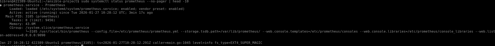
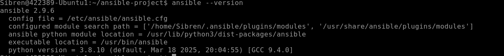
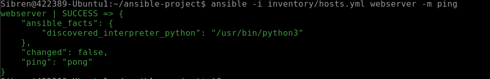
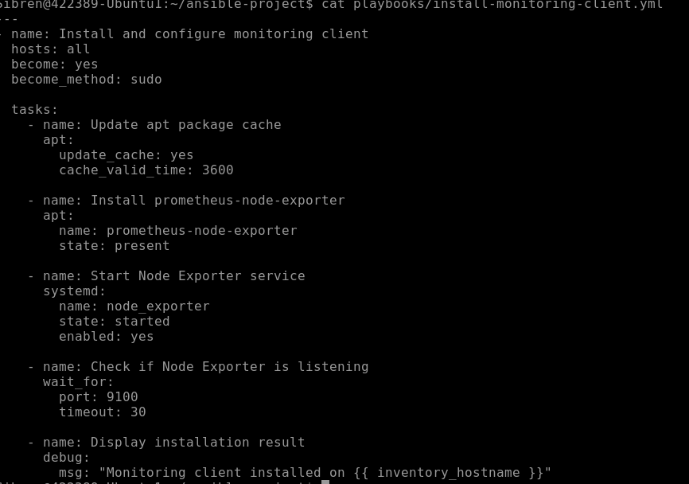
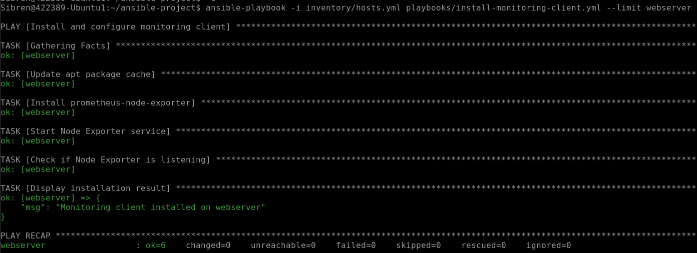
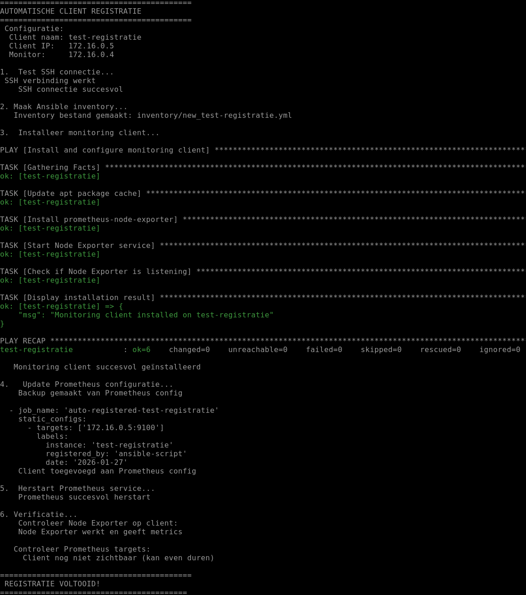
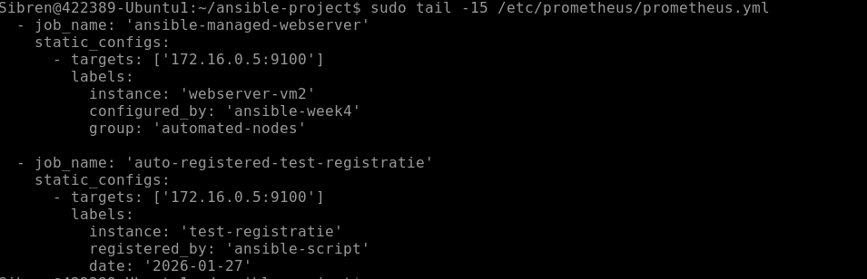
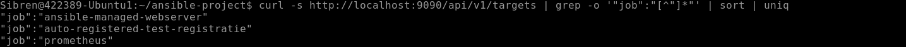
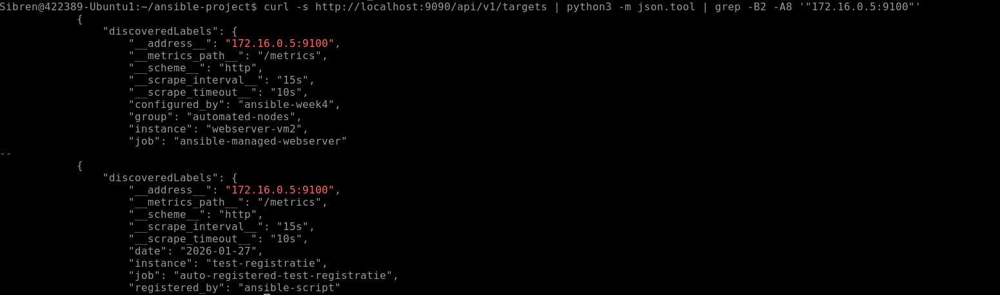

# Linux - Practicum Week 4

In deze opdracht breiden we de server, die in de vorige opdracht is opgezet als monitorserver, uit met een orchestration tool. De monitoringfunctionaliteit blijft behouden op deze server.

Het doel is om een Linux-client dusdanig in te richten dat deze automatisch:
1. De benodigde clientsoftware voor monitoring installeert.
2. Zichzelf registreert bij de monitorserver via een script.

Hierdoor wordt de nieuw ingerichte client automatisch gemonitord.

**Belangrijk**: Bij elk commando dat je uitvoert om een resultaat of antwoord te verkrijgen, is het verplicht om een screenshot te maken van je scherm als bewijs van voortgang. Deze afbeeldingen tonen aan dat de opdracht correct is uitgevoerd en helpen je ook om je resultaten bij te houden.

Verder is het essentieel om al je voortgang en resultaten vast te leggen in een private Git-repository (Bijvoorbeeld op GitHub). Hiermee leer je niet alleen werken met versiebeheer, maar zorg je er ook voor dat alle stappen van je werk overzichtelijk en reproduceerbaar zijn.

Bij voorkeur gebruik je MarkDown, zodat het document ook nog enigszins oogt. Via deze link vind je meer informatie over Markdown op github:
[Basic writing and formatting syntax - GitHub Docs](https://docs.github.com/en/github/writing-on-github/getting-started-with-writing-and-formatting-on-github/basic-writing-and-formatting-syntax)

Een manier om gemakkelijk met markdown en git te werken is door in Visual Studio Code(VS Code) een plug-in voor Markdown the instaleren, en vanuit VS Code commits te maken en deze te pushen naar je eigen private Git Repo.

## Inleveren
Zowel de tekstdocumenten als de geproduceerde scripts houden jullie bij op zowel jullie Git repo. De tekstdocumenten en Scripts leveren jullie ook in op de Elo omgeving.

1. Het script voor automatische registratie en monitoring.
2. Documentatie over de implementatiestappen inclusief screenshots van de werking van je oplossing.


## Opdrachtbeschrijving

### 1. Voorbereiding van de monitorserver
- Zorg ervoor dat de monitorserver correct functioneert.
- Behoud de bestaande monitoringfunctionaliteit terwijl je de server uitbreidt.

### 2. Installatie van de orchestration tool
- Installeer **Ansible** op de monitorserver.
- Controleer of Ansible correct werkt door een test uit te voeren, zoals een `ping`-module richting de client.


### 3. Scriptontwikkeling
- Schrijf een script dat het volgende uitvoert:
  - Installeer de monitoringclient op een nieuwe Linux-client.
  - Registreer de nieuwe client automatisch bij de monitorserver.




### 4. Automatische monitoring
- Test de scriptfunctionaliteit door een nieuwe Linux-client in te richten.
- Verifieer dat de nieuwe client correct wordt gemonitord door de monitorserver.



### 5. Documentatie en versiebeheer
- Houd al je voortgang bij in de **Git-repository**. Voeg hieraan toe:
  - Scripts en configuraties.
  - Documentatie over de implementatie.
  - Screenshots van werkende tests en outputs.


## Resultaten
Na voltooiing van deze opdracht moet je het volgende hebben:
- Een werkende monitorserver met Ansible.
- Een script dat nieuwe Linux-clients automatisch registreert en monitort.
- Een Git-repository met al je werk, inclusief scripts en documentatie.


## Script Inhoud

### 1. Ansible Playbook: `install-monitoring-client.yml`

Dit playbook installeert de Node Exporter op een nieuwe client.

```yaml
---
- name: Install and configure monitoring client
  hosts: all
  become: yes
  become_method: sudo
  
  tasks:
    - name: Update apt package cache
      apt:
        update_cache: yes
        cache_valid_time: 3600
    
    - name: Install prometheus-node-exporter
      apt:
        name: prometheus-node-exporter
        state: present
    
    - name: Start Node Exporter service
      systemd:
        name: node_exporter
        state: started
        enabled: yes
    
    - name: Check if Node Exporter is listening
      wait_for:
        port: 9100
        timeout: 30
    
    - name: Display installation result
      debug:
        msg: "Monitoring client installed on {{ inventory_hostname }}"


### 2. Bash Script: `register-client.sh`  
#!/bin/bash

echo "Automatische Client Registratie"
echo "================================"

CLIENT_NAME="$1"
CLIENT_IP="$2"

if [ -z "$CLIENT_NAME" ] || [ -z "$CLIENT_IP" ]; then
    echo "Gebruik: $0 <client_naam> <client_ip>"
    exit 1
fi

echo "Client: $CLIENT_NAME ($CLIENT_IP)"
echo ""

# Test SSH connectie
echo "1. Test SSH connectie..."
ssh -i ~/.ssh/id_ansible Sibren@$CLIENT_IP "echo 'SSH OK'"

# Voer Ansible playbook uit
echo ""
echo "2. Voer Ansible playbook uit..."
cd ~/ansible-project
ansible-playbook -i <(echo "all:
  hosts:
    $CLIENT_NAME:
      ansible_host: $CLIENT_IP
      ansible_user: Sibren
      ansible_ssh_private_key_file: ~/.ssh/id_ansible") playbooks/install-monitoring-client.yml

# Update Prometheus configuratie
echo ""
echo "3. Update Prometheus config..."
sudo tee -a /etc/prometheus/prometheus.yml << PROM_EOF

  - job_name: 'auto-$CLIENT_NAME'
    static_configs:
      - targets: ['$CLIENT_IP:9100']
PROM_EOF

# Herstart Prometheus
echo ""
echo "4. Herstart Prometheus..."
sudo systemctl restart prometheus

echo ""
echo "✅ Registratie voltooid voor $CLIENT_NAME"
echo "Controleer: http://172.16.0.4:9090/targets"