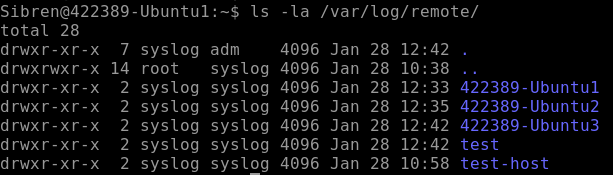
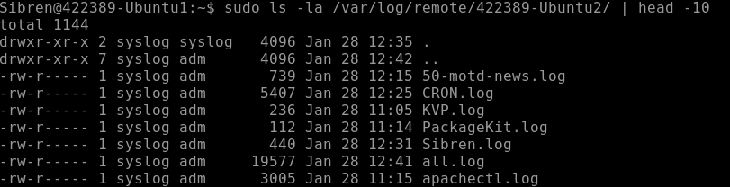
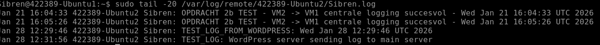
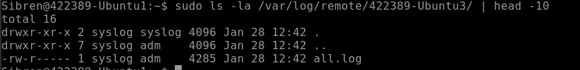
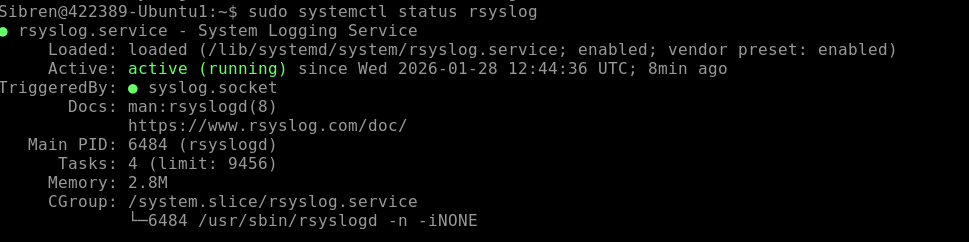
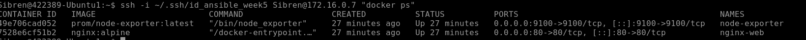
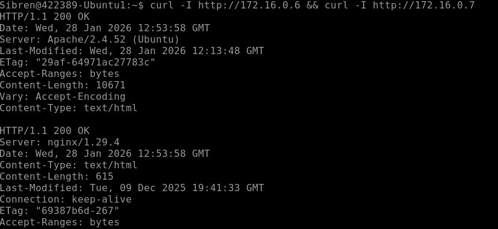
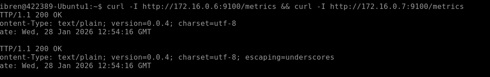
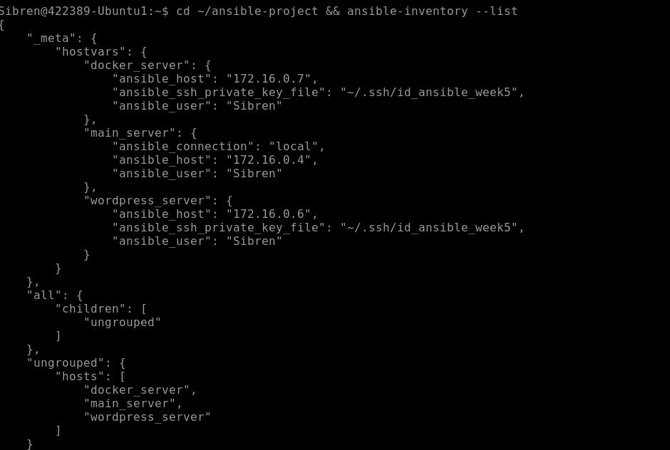
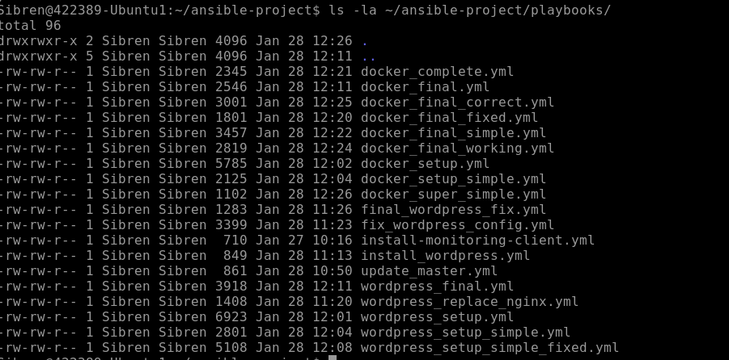

# Linux - Practicum Week 5- Eindopdracht

Voor deze eindopdracht realiseer je lokaal je eigen omgeving, bij voorkeur op **Azure**, maar een eigen inrichting mag ook.

**Belangrijk**: Bij elk commando dat je uitvoert om een resultaat of antwoord te verkrijgen, is het verplicht om een screenshot te maken van je scherm als bewijs van voortgang. Deze afbeeldingen tonen aan dat de opdracht correct is uitgevoerd en helpen je ook om je resultaten bij te houden.

Verder is het essentieel om al je voortgang en resultaten vast te leggen in een private Git-repository (Bijvoorbeeld op GitHub). Hiermee leer je niet alleen werken met versiebeheer, maar zorg je er ook voor dat alle stappen van je werk overzichtelijk en reproduceerbaar zijn.

Bij voorkeur gebruik je MarkDown, zodat het document ook nog enigszins oogt. Via deze link vind je meer informatie over Markdown op github:
[Basic writing and formatting syntax - GitHub Docs](https://docs.github.com/en/github/writing-on-github/getting-started-with-writing-and-formatting-on-github/basic-writing-and-formatting-syntax)

Een manier om gemakkelijk met markdown en git te werken is door in Visual Studio Code(VS Code) een plug-in voor Markdown the instaleren, en vanuit VS Code commits te maken en deze te pushen naar je eigen private Git Repo.

## Inleveren
Zowel de tekstdocumenten als de geproduceerde scripts houden jullie bij op zowel jullie Git repo. De tekstdocumenten, Scripts en opname leveren jullie ook in op de Elo omgeving.

1. Het script voor automatische registratie en monitoring.
2. Documentatie over de implementatiestappen inclusief screenshots van de werking van je oplossing.
3. Een opname waar jullie de werkende omgeving demonstreren.

## Opdrachtbeschrijving

### 1. Hoofdserver inrichten
- Zet een hoofdserver op met de volgende functionaliteiten:
  - **Centrale Log en Monitoring service**
  - **Orchestration** met **Ansible**

- **Ansible-configuratie:**
  - Installeer *Ansible* op de hoofdserver.
  - Zorg ervoor dat de hoofdserver zichzelf kan **updaten** via Ansible (zowel het OS als Ansible zelf).

> Hiervoor kun je je Monitor server uit weekopdracht 4 voor gebruiken.

> Overleg eventueel met de docent over de te gebruiken logservice en monitoringtool als je andere tooling wilt gebruiken dan uit weekopdracht 3.
### 2. Twee extra servers opzetten
- Realiseer twee servers met de volgende functies:
  - **Server 1:** Installeer en configureer **WordPress**.
  - **Server 2:** Installeer en configureer **Docker**.
- **Inrichting via Ansible:**
  - De volledige inrichting van de servers (WordPress, Docker, monitoringtools) moet via Ansible worden uitgevoerd.
  - Ook de monitoringclient op deze servers moet via Ansible worden geïnstalleerd en geconfigureerd zodat deze door de _hoofdserver_ gemonitored kunnen worden.

## Eisen en richtlijnen

### 1. Git-repository
- Houd alle scripts en voortgang bij in een **Git-repository**.
- **Eigen werk verplicht:**
  - Alle scripts moeten door jullie worden geschreven.
  - Indien je scripts gebruikt die je online hebt gevonden:
    - Geef de bron duidelijk aan.
    - Zorg dat je het script volledig kunt uitleggen.
  - **Plagiaat wordt streng bestraft.** Bij constatering wordt de opdracht niet beoordeeld en wordt melding gemaakt bij de examencommissie.

## Verwachte resultaten
- Een volledig ingerichte hoofdserver met:
  - Een Log en Monitoring service.
  - Ansible-configuratie voor self-updates.
- Twee extra servers met:
  - WordPress geïnstalleerd en geconfigureerd.
  - Docker geïnstalleerd en geconfigureerd.
- De logging/monitoring data van alle servers worden naar de hoofdserver verstuurd.
- Een bijgewerkte en complete Git-repository.
- Een opname waar jullie de werkende omgeving demonstreren.

<video controls src="../Recording 2026-01-28 140808.mp4" title="Title"></video>

## Gebruikte Scripts

cat > playbooks/wordpress_final.yml << 'EOF'
---
- name: Install and configure WordPress on vm2
  hosts: wordpress_server
  become: yes
  vars:
    wp_db_name: "wordpress"
    wp_db_user: "wpuser"
    wp_db_password: "WpSecurePass456!"
    
  tasks:
    1. System updates
    - name: Update and upgrade system
      apt:
        update_cache: yes
        upgrade: yes
        cache_valid_time: 3600

    2. Create web directory
    - name: Ensure web directory exists
      file:
        path: /var/www/html
        state: directory
        owner: www-data
        group: www-data
        mode: '0755'

    3. Install Apache
    - name: Install Apache
      apt:
        name: apache2
        state: present

    - name: Start and enable Apache
      service:
        name: apache2
        state: started
        enabled: yes

    1. Install MySQL (eenvoudigere versie)
    - name: Install MySQL server
      apt:
        name: mysql-server
        state: present

    - name: Start and enable MySQL
      service:
        name: mysql
        state: started
        enabled: yes

    5. Install PHP
    - name: Install PHP and required extensions
      apt:
        name:
          - php
          - php-mysql
          - php-cli
          - php-curl
          - php-gd
          - php-mbstring
          - php-xml
          - libapache2-mod-php
        state: present

    6. Download and extract WordPress
    - name: Download WordPress
      shell: |
        cd /tmp
        wget -q https://wordpress.org/latest.tar.gz
        tar -xzf latest.tar.gz
      args:
        executable: /bin/bash

    - name: Copy WordPress files
      shell: |
        cp -r /tmp/wordpress/* /var/www/html/
        chown -R www-data:www-data /var/www/html
        chmod -R 755 /var/www/html
      args:
        executable: /bin/bash

    7. Configure WordPress database
    - name: Create WordPress database and user
      shell: |
        mysql -u root -e "CREATE DATABASE IF NOT EXISTS ${wp_db_name};"
        mysql -u root -e "CREATE USER IF NOT EXISTS '${wp_db_user}'@'localhost' IDENTIFIED BY '${wp_db_password}';"
        mysql -u root -e "GRANT ALL PRIVILEGES ON ${wp_db_name}.* TO '${wp_db_user}'@'localhost';"
        mysql -u root -e "FLUSH PRIVILEGES;"
      args:
        executable: /bin/bash
      environment:
        wp_db_name: "{{ wp_db_name }}"
        wp_db_user: "{{ wp_db_user }}"
        wp_db_password: "{{ wp_db_password }}"

    8. Configure wp-config.php
    - name: Configure WordPress settings
      shell: |
        cd /var/www/html
        cp wp-config-sample.php wp-config.php
        sed -i "s/database_name_here/${wp_db_name}/" wp-config.php
        sed -i "s/username_here/${wp_db_user}/" wp-config.php
        sed -i "s/password_here/${wp_db_password}/" wp-config.php
      args:
        executable: /bin/bash
      environment:
        wp_db_name: "{{ wp_db_name }}"
        wp_db_user: "{{ wp_db_user }}"
        wp_db_password: "{{ wp_db_password }}"

    9. Enable Apache modules
    - name: Enable required Apache modules
      shell: |
        a2enmod rewrite
        systemctl restart apache2
      args:
        executable: /bin/bash

    10. Install monitoring
    - name: Install monitoring tools
      apt:
        name:
          - prometheus-node-exporter
          - rsyslog
        state: present

    - name: Start monitoring services
      service:
        name: "{{ item }}"
        state: started
        enabled: yes
      loop:
        - prometheus-node-exporter
        - rsyslog

    11. Configure logging to main server
    - name: Setup log forwarding
      copy:
        dest: /etc/rsyslog.d/99-forward.conf
        content: |
          Forward all logs to main server
          *.* @@172.16.0.4:514
        owner: root
        group: root
        mode: '0644'
      notify: restart rsyslog

  handlers:
    - name: restart rsyslog
      service:
        name: rsyslog
        state: restarted
EOF

cat > playbooks/docker_final.yml << 'EOF'
---
- name: Install and configure Docker on vm3
  hosts: docker_server
  become: yes
  
  tasks:
    1. Update system
    - name: Update and upgrade system
      apt:
        update_cache: yes
        upgrade: yes
        cache_valid_time: 3600

    2. Install Docker
    - name: Install Docker
      apt:
        name: docker.io
        state: present

    - name: Start and enable Docker
      service:
        name: docker
        state: started
        enabled: yes

    3. Add user to docker group
    - name: Add current user to docker group
      shell: |
        usermod -aG docker {{ ansible_user }}
      args:
        executable: /bin/bash

    4. Run Nginx container
    - name: Run Nginx web server
      shell: |
        docker run -d \
          --name nginx-web \
          -p 80:80 \
          --restart always \
          nginx:alpine
      args:
        executable: /bin/bash
      register: container_result
      changed_when: "'Created' in container_result.stdout or 'Started' in container_result.stdout"

    5. Install monitoring
    - name: Install monitoring tools
      apt:
        name:
          - prometheus-node-exporter
          - rsyslog
        state: present

    - name: Start monitoring services
      service:
        name: "{{ item }}"
        state: started
        enabled: yes
      loop:
        - prometheus-node-exporter
        - rsyslog

    6. Configure logging to main server
    - name: Setup log forwarding
      copy:
        dest: /etc/rsyslog.d/99-forward.conf
        content: |
          Forward all logs to main server
          *.* @@172.16.0.4:514
        owner: root
        group: root
        mode: '0644'
      notify: restart rsyslog

    7. Run Node Exporter for monitoring
    - name: Run Node Exporter container
      shell: |
        docker run -d \
          --name node-exporter \
          -p 9100:9100 \
          --restart always \
          -v "/proc:/host/proc:ro" \
          -v "/sys:/host/sys:ro" \
          -v "/:/rootfs:ro" \
          prom/node-exporter:latest \
          --path.procfs=/host/proc \
          --path.rootfs=/rootfs \
          --path.sysfs=/host/sys \
          --collector.filesystem.mount-points-exclude="^/(sys|proc|dev|host|etc)($$|/)"
      args:
        executable: /bin/bash
      register: node_exporter_result
      changed_when: "'Created' in node_exporter_result.stdout or 'Started' in node_exporter_result.stdout"

  handlers:
    - name: restart rsyslog
      service:
        name: rsyslog
        state: restarted
EOF

